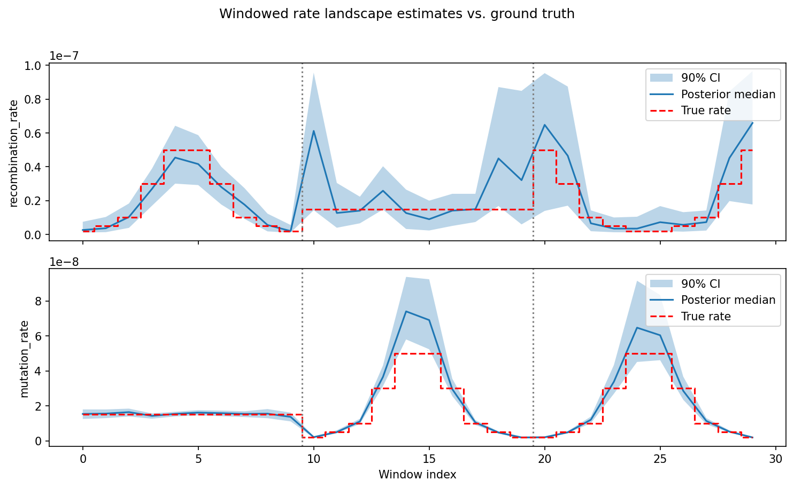

Soup-to-Nuts Tutorial: Rate Landscape Estimation
==================================================

In this tutorial we will build a complete simulation-based inference pipeline
that estimates mutation rate and recombination rate across a genomic region.
By the end we will have:

- A custom **simulator** that generates tree sequences under a constant-size
  population model with two free parameters (recombination rate and mutation
  rate)
- A **YAML config** that wires the simulator to a CNN-based processor and
  embedding network
- A trained neural posterior estimator
- **Windowed posterior estimates** of both rates across a simulated genome
  with known, spatially varying rate landscapes, so we can check that the
  model recovers the ground truth

In this example training uses windows with *constant* rates (drawn
from a prior), while prediction applies the trained model window-by-window
to a VCF where rates *vary spatially* — producing a rate landscape.

   The final result: posterior estimates of recombination rate (top) and
   mutation rate (bottom) across 30 genomic windows, compared against the
   true rates used to simulate the example data. Blue shading shows the
   90% credible interval; dashed red line is the ground truth. Vertical
   dotted lines mark chromosome boundaries.

.. note::
   With 5,000 training simulations and the default config, the full
   tutorial (training + prediction) takes about **15 minutes** on a machine
   with an NVIDIA A100 GPU using 4 cores. Simulation is the bottleneck; on
   a cluster you can parallelize it further with ``n_chunk``. Training on
   CPU will be slower but still feasible.

Prerequisites
-------------

Make sure you have installed popgen-npe and activated the environment following
the instructions in :doc:`installation`. All commands below assume the conda
environment is active and that you are working from the repository root.

What we are building
--------------------

.. code-block:: text

   Files we will create
   ─────────────────────
   workflow/
   ├── scripts/
   │   └── ts_simulators.py       ← add MutRecRate class here
   └── config/
       └── MutRecRate_cnn.yaml    ← new config file

   Files shipped with the repo
   ───────────────────────────
   example_data/
   └── MutRecRate/
       ├── test.vcf.gz            ← synthetic VCF with variable rates
       ├── test.vcf.gz.tbi
       ├── popmap.yaml
       ├── windows.bed
       └── true_rates.tsv         ← ground truth for comparison

Step 1: Write the simulator
----------------------------

Open ``workflow/scripts/ts_simulators.py`` in your favorite editor and add the following class.

The simulator API
^^^^^^^^^^^^^^^^^

Every simulator must:

1. Inherit from ``BaseSimulator``
2. Define a ``default_config`` dict whose keys are either **fixed** parameters
   (single values) or **random** parameters (two-element ``[low, high]`` lists
   defining uniform prior bounds)
3. In ``__init__``, build ``self.parameters`` (an ordered list of random
   parameter names) and ``self.prior`` (a ``BoxUniform`` over those ranges)
4. Implement ``__call__(self, seed) -> (tskit.TreeSequence, np.ndarray)`` which
   samples parameters, simulates a tree sequence with mutations, and returns
   both

Full code listing
^^^^^^^^^^^^^^^^^

.. code-block:: python

   class MutRecRate(BaseSimulator):
       """
       Constant-size population with variable mutation and recombination
       rates. Designed for windowed estimation of rate landscapes we train
       on single windows with constant rates, then predict per-window on
       real data.
       """

       default_config = {
           # Fixed parameters
           "samples": {"pop": 20},
           "sequence_length": 500000,
           "pop_size": 10000,
           # Random parameters — [low, high] uniform prior bounds
           "recombination_rate": [1e-9, 1e-7],
           "mutation_rate": [1e-9, 1e-7],
       }

       def __init__(self, config: dict):
           super().__init__(config, self.default_config)
           self.parameters = ["recombination_rate", "mutation_rate"]
           self.prior = BoxUniform(
               low=torch.tensor([self.recombination_rate[0],
                                 self.mutation_rate[0]]),
               high=torch.tensor([self.recombination_rate[1],
                                  self.mutation_rate[1]]),
           )

       def __call__(self, seed: int = None) -> (tskit.TreeSequence, np.ndarray):
           torch.manual_seed(seed)
           theta = self.prior.sample().numpy()
           recomb_rate, mut_rate = theta

           demography = msprime.Demography()
           demography.add_population(name="pop", initial_size=self.pop_size)

           ts = msprime.sim_ancestry(
               samples={"pop": self.samples["pop"]},
               demography=demography,
               sequence_length=self.sequence_length,
               recombination_rate=recomb_rate,
               random_seed=seed,
           )
           ts = msprime.sim_mutations(ts, rate=mut_rate, random_seed=seed)

           return ts, theta

**Key points:**

- ``self.parameters`` defines the order of values in the returned ``theta``
  array. This order is used everywhere downstream (training targets, posterior
  samples, diagnostic plots), so it must be consistent.
- ``BoxUniform`` (from ``sbi.utils``) is already imported at the top of
  ``ts_simulators.py``.
- The population here is named ``"pop"`` (a string, not an integer) — this is
  required for the prediction pipeline's population-name matching to work.
- The ``sequence_length`` (500 kb) matches the window size in the BED file
  used for prediction. Training windows and prediction windows must be the
  same size.
- The prior spans two orders of magnitude (1e-9 to 1e-7), covering the
  biologically relevant range for most eukaryotes.

Quick sanity check
^^^^^^^^^^^^^^^^^^

.. code-block:: python

   from workflow.scripts.ts_simulators import MutRecRate

   sim = MutRecRate({"class_name": "MutRecRate"})
   ts, theta = sim(seed=42)
   print(f"Parameters: {dict(zip(sim.parameters, theta))}")
   print(f"Num sites:  {ts.num_sites}")
   print(f"Num trees:  {ts.num_trees}")

Step 2: Configure the processor
---------------------------------

We use the built-in ``cnn_extract`` processor, which converts a tree sequence
into a genotype matrix suitable for a convolutional neural network. No new code
is needed here, but one can introduce there own custom processors.

``cnn_extract`` produces an array of shape ``(2, n_individuals, n_snps)`` for a
single population. The two channels are SNP positions and genotype values. The
``ExchangeableCNN`` embedding network expects exactly this format.

Key parameters
^^^^^^^^^^^^^^

.. list-table::
   :header-rows: 1
   :widths: 20 60 20

   * - Parameter
     - Meaning
     - Our value
   * - ``n_snps``
     - Maximum number of SNPs to retain
     - 1000
   * - ``maf_thresh``
     - Minor allele frequency filter; 0.0 keeps all sites
     - 0.0
   * - ``phased``
     - Whether to keep haplotype-level data (True) or collapse to diploid
       genotypes (False)
     - False
   * - ``polarised``
     - Must be False for ``cnn_extract``
     - False

We use ``maf_thresh: 0.0`` because the full site frequency spectrum
(including rare variants) carries information about the mutation rate.

Step 3: Write the config YAML
-------------------------------

Create the file ``workflow/config/MutRecRate_cnn.yaml`` with the contents
below. Every field is annotated.

.. code-block:: yaml

   # ── Project location ─────────────────────────────────────────────
   # All outputs go under this directory, inside a UID-based
   # subdirectory.  Change this to wherever you want results written.
   project_dir: "/path/to/your/project/dir"

   # ── Resource allocation, if you want to run on a slurm cluster
   cpu_resources:
     runtime: "2h"
     mem_mb: 16000

   gpu_resources:
     runtime: "4h"
     mem_mb: 50000
     gpus: 1
     slurm_partition: "gpu"        
     slurm_extra: "--gres=gpu:1"

   # ── Simulation settings ──────────────────────────────────────────
   random_seed: 42
   n_chunk: 10          # number of parallel simulation jobs
   n_train: 5000        # training simulations
   n_val: 500           # validation simulations
   n_test: 500          # test simulations (used for diagnostics)

   # ── Training hyperparameters ─────────────────────────────────────
   train_embedding_net_separately: True   # two-stage training
   use_cache: True                        # load features into CPU memory
   optimizer: "Adam"
   batch_size: 64
   learning_rate: 0.0005
   max_num_epochs: 200
   stop_after_epochs: 50       # early stopping patience
   clip_max_norm: 5
   packed_sequence: False

   # ── Simulator ────────────────────────────────────────────────────
   # class_name must match the class you added to ts_simulators.py.
   # sequence_length must equal the window size in the BED file.
   simulator:
     class_name: "MutRecRate"
     samples:
       pop: 20
     sequence_length: 500000
     pop_size: 10000

   # ── Processor ────────────────────────────────────────────────────
   processor:
     class_name: "cnn_extract"
     n_snps: 1000
     maf_thresh: 0.0

   # ── Embedding network ────────────────────────────────────────────
   # input_rows: number of individuals per population (list, one per pop)
   # input_cols: number of SNPs per population (list, one per pop)
   embedding_network:
     class_name: "ExchangeableCNN"
     output_dim: 64
     input_rows: [20]
     input_cols: [1000]

   # ── Prediction ───────────────────────────────────────────────────
   prediction:
     n_chunk: 5
     vcf: "example_data/MutRecRate/test.vcf.gz"
     population_map: "example_data/MutRecRate/popmap.yaml"
     windows: "example_data/MutRecRate/windows.bed"
     min_snps_per_window: 10

**What are all these yaml fields anyway? Some explanation:**

- ``project_dir`` — the workflow creates a subdirectory named
  ``MutRecRate-cnn_extract-ExchangeableCNN-42-5000-sep`` under this path
  (the naming scheme is
  ``{simulator}-{processor}-{embedding}-{seed}-{n_train}-{sep|e2e}``).
- ``n_chunk`` controls parallelism.  With ``n_train: 5000`` and
  ``n_chunk: 10``, each chunk simulates 500 tree sequences.  On a laptop,
  ``n_chunk: 1`` or ``2`` is fine; on a cluster you can go much higher.
- ``train_embedding_net_separately: True`` means the CNN embedding is
  pre-trained, then the normalizing flow is trained on the learned
  embeddings.  This is can be more stable than end-to-end training.
- ``sequence_length: 500000`` — this **must match** the window size in
  ``windows.bed``. Training windows and prediction windows must be the
  same size so the network sees the same scale of data.
- ``input_rows`` and ``input_cols`` must match the processor output: 20
  individuals and 1000 SNPs.

Step 4: Run the training workflow
----------------------------------

From the repository root:

.. code-block:: bash

   snakemake \
       --configfile workflow/config/MutRecRate_cnn.yaml \
       --snakefile workflow/training_workflow.smk \
       --cores 4

.. tip::
   On a local machine with no GPU, training will still work (PyTorch falls
   back to CPU) but will be slower. With 5,000 training simulations and the
   network sizes above, expect roughly 10–30 minutes depending on your machine.

What happens
^^^^^^^^^^^^

The workflow runs these stages in order:

1. **Setup** — creates the Zarr data store and divides the simulations into
   chunks.
2. **Simulate** — each chunk calls ``MutRecRate(seed=...)`` repeatedly,
   drawing random rate pairs from the prior and simulating constant-rate
   windows.
3. **Process** — each chunk calls ``cnn_extract`` on every tree sequence,
   storing the resulting tensors in Zarr.
4. **Train embedding network** — trains the ``ExchangeableCNN`` to produce
   useful summary statistics from genotype matrices.
5. **Train normalizing flow** — trains a neural posterior estimator
   conditioned on the learned embeddings.
6. **Diagnostics** — generates posterior calibration, concentration, and
   simulation summary plots.

Output files
^^^^^^^^^^^^

After a successful run you will find (under your ``project_dir``):

.. code-block:: text

   MutRecRate-cnn_extract-ExchangeableCNN-42-5000-sep/
   ├── tensors/zarr/                    # Zarr store with features and targets
   ├── trees/                           # Simulated tree sequences (.trees)
   ├── logs/                            # TensorBoard training logs
   ├── pretrain_embedding_network       # Pickled trained CNN
   ├── pretrain_normalizing_flow        # Pickled trained flow
   └── plots/
       ├── posterior_calibration.png
       ├── posterior_concentration.png
       ├── posterior_expectation.png
       ├── posterior_at_prior_mean.png
       ├── posterior_at_prior_low.png
       ├── posterior_at_prior_high.png
       ├── simulation_stats.png
       ├── stats_vs_params_pairplot.png
       └── stats_heatmaps.png

Inspecting results
^^^^^^^^^^^^^^^^^^

The diagnostic plots are the quickest way to check that inference is working:

- **posterior_calibration.png** — simulation-based calibration plot; points 
  falling on the diagonal indicate well-calibrated posteriors.
- **posterior_concentration.png** — shows how ratio of posterior to prior width
  change as a function of coverage for each parameter.
- **posterior_expectation.png** — posterior means vs. true parameter values;
  points near the diagonal mean the model is recovering the parameters.
- **posterior_at_prior_mean.png / _low.png / _high.png** — posterior
  distributions evaluated at specific points in the prior (mean, lower bound,
  upper bound), useful for spotting bias at the edges of the parameter space.
- **simulation_stats.png** — summary statistics of the simulated datasets.
- **stats_vs_params_pairplot.png** — pairwise relationships between simulation
  summary statistics and the underlying parameters.
- **stats_heatmaps.png** — heatmaps showing correlations between summary
  statistics and parameters.

You can also monitor training loss in real time with TensorBoard:

.. code-block:: bash

   tensorboard --logdir /path/to/your/project/dir/MutRecRate-cnn_extract-ExchangeableCNN-42-5000-sep/logs

Step 5: Run prediction on the example data
--------------------------------------------

The prediction workflow applies your trained model to genomic data stored in
VCF format, producing windowed posterior estimates across the genome.

The bundled example data in ``example_data/MutRecRate/`` contains a synthetic
VCF simulated with spatially varying recombination and mutation rates across
three chromosomes (5 Mb each, 10 windows of 500 kb per chromosome). This lets
you verify that the trained model recovers the known rate landscape.

The example data includes:

- **test.vcf.gz** — simulated with ``msprime.RateMap`` objects so that rates
  vary across windows (e.g., chr0 has varying recombination but constant
  mutation; chr1 has varying mutation but constant recombination; chr2 has
  both varying in opposite directions).
- **popmap.yaml** — maps all 20 VCF samples to population ``"pop"``.
- **windows.bed** — 30 windows (10 per chromosome, 500 kb each).
- **true_rates.tsv** — ground truth recombination and mutation rates per
  window, for comparison with the model's predictions.

Requirements for prediction data
^^^^^^^^^^^^^^^^^^^^^^^^^^^^^^^^^

If you are bringing your own data instead of using the example, note:

- The VCF must be bgzipped and tabix-indexed.
- Every contig must have a length in the VCF header
  (``##contig=<ID=...,length=...>``). If contig lengths are missing,
  ``tsinfer`` will fail with ``sequence_length cannot be zero or less``.
- The number of samples in the VCF (after filtering via the population map)
  must **exactly match** the simulator's ``samples`` config — in our case,
  20 diploid individuals assigned to population ``"pop"``.
- Window sizes in the BED file should match the simulator's
  ``sequence_length``.

The population map assigns VCF sample names to simulator population names:

.. code-block:: yaml

   # popmap.yaml
   IND0: "pop"
   IND1: "pop"
   IND2: "pop"
   # ... one entry per VCF sample

Run the prediction workflow
^^^^^^^^^^^^^^^^^^^^^^^^^^^

The ``prediction`` block is already in the config from Step 3. Run:

.. code-block:: bash

   snakemake \
       --configfile workflow/config/MutRecRate_cnn.yaml \
       --snakefile workflow/prediction_workflow.smk \
       --cores 4

What the prediction workflow does
^^^^^^^^^^^^^^^^^^^^^^^^^^^^^^^^^^

1. **Convert VCF** — converts the bgzipped VCF to Zarr format (``vcf2zarr``).
2. **Setup** — validates that VCF samples match the simulator, defines
   windows, and creates Zarr storage.
3. **Infer trees** — for each window, infers a tree sequence from the
   genotype data using ``tsinfer``.
4. **Process** — applies the same ``cnn_extract`` processor to each inferred
   tree sequence.
5. **Predict** — loads the trained embedding network and normalizing flow,
   and draws 1,000 posterior samples per window.
6. **Diagnostics** — generates summary plots.

Prediction output
^^^^^^^^^^^^^^^^^

.. code-block:: text

   test.vcf.gz/
   ├── vcz/                    # Zarr-encoded VCF
   ├── trees/                  # Inferred tree sequences (one per window)
   ├── tensors/zarr/           # Features and posterior samples
   │   └── predictions         # Shape: (n_windows, n_parameters, 1000)
   └── plots/
       ├── posteriors-across-windows.png
       └── tree_stats_hist.png

- **posteriors-across-windows.png** — a heatmap showing the posterior
  distribution for each parameter across all 30 genomic windows. This is the
  main result: you should see the posterior mode tracking the true rate
  landscape across windows and chromosomes (separated by red dashed lines).
- **tree_stats_hist.png** — summary statistics of the inferred tree
  sequences compared with simulated training data, useful for checking
  that the real data falls within the range the model was trained on.

Step 6: Interpret the results
------------------------------

The raw posterior samples are stored in ``tensors/zarr/predictions`` as a
NumPy array of shape ``(n_windows, n_parameters, 1000)``. You can load them
for downstream analysis and compare against the known ground truth:

.. code-block:: python

   import zarr
   import numpy as np
   import matplotlib.pyplot as plt

   # Load predictions and ground truth
   project = "/path/to/your/project/dir/MutRecRate-cnn_extract-ExchangeableCNN-42-5000-sep"
   predictions = zarr.load(f"{project}/test.vcf.gz/tensors/zarr/predictions")
   true_rates = np.loadtxt("example_data/MutRecRate/true_rates.tsv",
                           skiprows=1, usecols=[3, 4])

   param_names = ["recombination_rate", "mutation_rate"]
   fig, axes = plt.subplots(2, 1, figsize=(10, 6), sharex=True)
   for i, (ax, name) in enumerate(zip(axes, param_names)):
       # Plot posterior medians and 90% credible intervals
       medians = np.median(predictions[:, i, :], axis=1)
       lo = np.quantile(predictions[:, i, :], 0.05, axis=1)
       hi = np.quantile(predictions[:, i, :], 0.95, axis=1)
       windows = np.arange(predictions.shape[0])
       ax.fill_between(windows, lo, hi, alpha=0.3, label="90% CI")
       ax.plot(windows, medians, label="Posterior median")
       ax.step(windows, true_rates[:, i], where="mid",
               color="red", linestyle="--", label="True rate")
       ax.set_ylabel(name)
       ax.legend(loc="upper right")
       # Mark chromosome boundaries
       for b in [10, 20]:
           ax.axvline(b - 0.5, color="gray", linestyle=":")
   axes[-1].set_xlabel("Window index")
   plt.tight_layout()
   plt.savefig("rate_landscape_comparison.png", dpi=150)

Next steps
----------

- **Try log-scale priors** — rates spanning orders of magnitude are more
  naturally modeled with log-uniform priors.  You could sample in log space
  (e.g., ``log10_recomb_rate: [-9, -7]``) and exponentiate inside
  ``__call__``, similar to the ``VariablePopulationSize`` simulator.
- **Try different architectures** — swap ``cnn_extract`` / ``ExchangeableCNN``
  for ``genotypes_and_distances`` / ``RNN``, or use summary statistics with
  ``tskit_sfs`` / ``SummaryStatisticsEmbedding``. See the
  :doc:`processor–network compatibility table <processors>` for valid
  combinations.
- **Explore existing configs** — the ``workflow/config/`` directory has
  examples for multi-population models (``YRI_CEU_cnn.yaml``), variable
  population size (``variable_popnSize_spidna.yaml``), and more.
- **Scale up** — increase ``n_train`` and ``n_chunk`` for better inference,
  and use SLURM resource blocks for cluster execution. See :doc:`usage` for
  details.
- **Consult the API reference** — :doc:`simulators` and :doc:`processors`
  document every built-in class, their parameters, and their configuration
  options.
